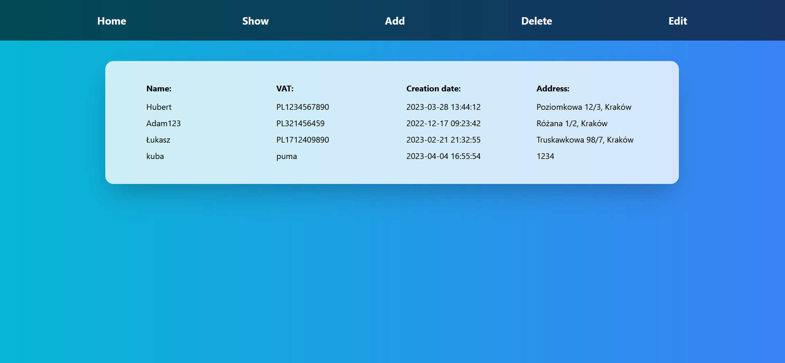
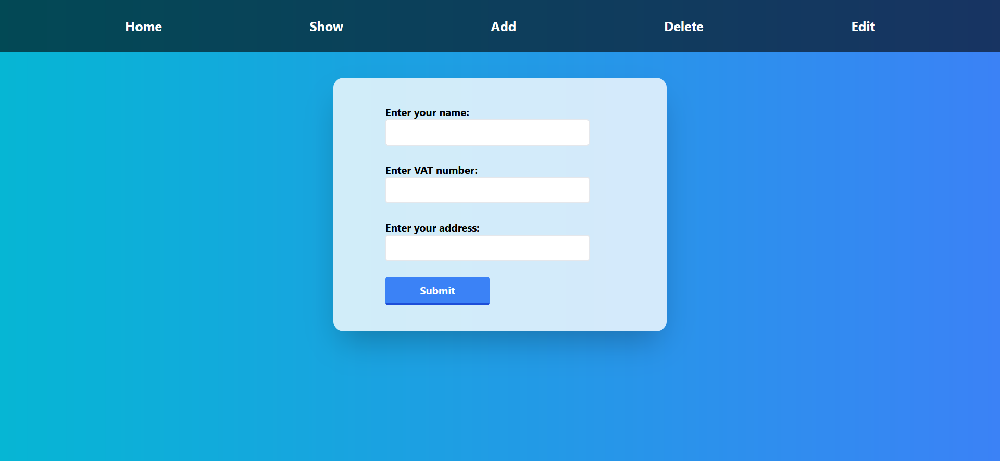
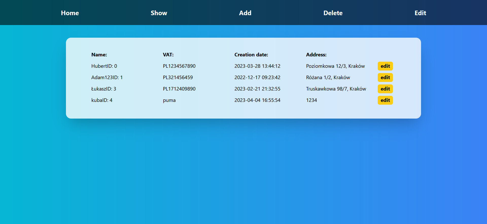

# Setup 
1. Clone repo.
2. Enter Recruitment-task directory. >cd Recruitment-task
3. Enter server directory. >cd server
4. Install packages. >npm install
5. Start server. > node index
6. In other terminal enter Recruitment-task and client directory. >cd Recruitment-task/client
7. Start react-app. >npm start
8. App should start in the browser at http://localhost:3000/

# Preview 
1. Home page

2. Show customer page

3. Add customer page

3. Delete customer page

3. Edit customer page

